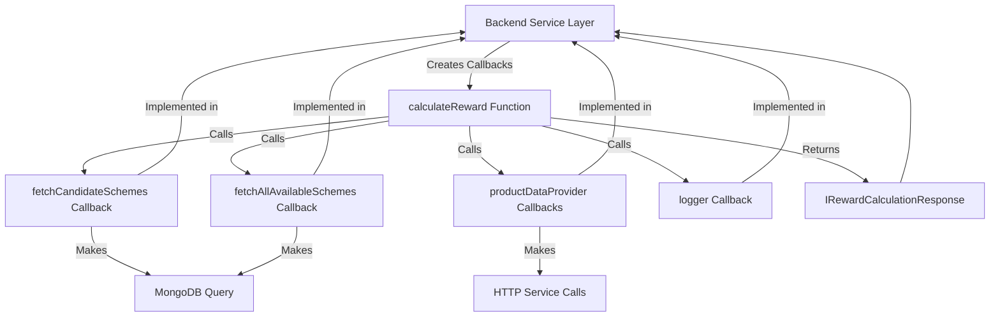

# Architecture: @naga/reward-calculator

## Overview

`@naga/reward-calculator` is a framework-agnostic npm package that provides reward calculation functionality for discount schemes. It uses a **higher-order function pattern** with **callback-based architecture** to replace all HTTP service calls and database operations.

## Core Design Principle

**All external dependencies (HTTP calls, database queries) are replaced with callback functions passed as arguments.**

The package never makes direct HTTP or database calls. Instead, it accepts callback functions that the service layer implements, making the package:
- Framework-agnostic (no NestJS, MongoDB, HTTP client dependencies)
- Testable (easy to mock callbacks)
- Flexible (works offline with direct data or online with callbacks)

## Architecture Diagram



## Callback-Based Data Fetching

### Scheme Fetching Callbacks

The package requires three callback functions for fetching schemes:

1. **`fetchCandidateSchemes`** - Fetches candidate schemes for evaluation
   - Receives: `FetchCandidateSchemesParams` (warehouseId, channelId, businessTypeId, includeSchemes, excludeSchemes, now)
   - Returns: `Promise<IScheme[]>` - Normalized scheme data
   - Service layer: Builds MongoDB query and fetches schemes

2. **`fetchMissingExcludedSchemes`** (optional) - Fetches explicitly excluded schemes
   - Receives: `FetchMissingExcludedSchemesParams` (schemeIds, now)
   - Returns: `Promise<IScheme[]>` - Normalized scheme data
   - Service layer: Fetches specific schemes by IDs

3. **`fetchAllAvailableSchemes`** - Fetches all available schemes for visibility
   - Receives: `FetchAllAvailableSchemesParams` (warehouseId, channelId, businessTypeId, outletId, now)
   - Returns: `Promise<IScheme[]>` - Normalized scheme data
   - Service layer: Builds MongoDB query for all applicable schemes

### Product Data Provider Callbacks (Optional)

For product-related data fetching (replaces HTTP service calls):

1. **`getProductCapacityInKg`** - Gets product capacity/weight in kg
   - Receives: `productId: string`
   - Returns: `Promise<number>` - Capacity in kg (0 if not available)
   - Service layer: Makes HTTP call to product service

2. **`getProductUomDetails`** - Gets product UOM (Unit of Measurement) details
   - Receives: `productId: string`
   - Returns: `Promise<{ baseUom?: string; unitPerCase?: Array<...> } | null>`
   - Service layer: Makes HTTP call to product service

3. **`getPricingGroupProducts`** - Gets pricing group product mappings
   - Receives: `productIds: string[]`
   - Returns: `Promise<any[]>` - Pricing group product mappings
   - Service layer: Makes HTTP call to product service

4. **`getPricingGroups`** - Gets pricing groups
   - Receives: `groupIds: string[]`
   - Returns: `Promise<any[]>` - Pricing groups
   - Service layer: Makes HTTP call to product service

### Logger Callback (Optional)

- **`logger`** - Logging function
  - Receives: `level: 'log' | 'debug' | 'warn' | 'error'`, `message: string`
  - Returns: `void`
  - Service layer: Maps to NestJS logger or console

## Package Structure

```
scheme-engine/
├── src/
│   ├── calculate-reward.ts          # Main calculateReward function
│   ├── interfaces/
│   │   └── scheme.interface.ts      # All TypeScript interfaces
│   ├── services/
│   │   ├── evaluators.ts            # Scheme evaluation logic (uses callbacks)
│   │   ├── validators.ts             # Validation logic (no HTTP/DB)
│   │   └── trackers.ts               # Tracking logic (no HTTP/DB)
│   ├── utils/
│   │   ├── logger.ts                 # Logger interface
│   │   └── product-data-provider.ts  # Product data provider interface
│   └── index.ts                      # Package exports
└── dist/                             # Compiled JavaScript
```

## Data Flow

### 1. Backend Service Creates Callbacks

```typescript
// In SchemesService.calculateReward()
const fetchCandidateSchemes = async (params) => {
  // Build MongoDB query
  const query = { /* ... */ };
  // Fetch from database
  const schemes = await this.mongoDbServices.schemes.find(query);
  // Normalize and return
  return normalizeSchemes(schemes);
};

const productDataProvider = {
  getProductCapacityInKg: async (productId) => {
    // Make HTTP call
    const product = await this.httpClientService.post('...');
    return product.capacity;
  }
};
```

### 2. Package Calls Callbacks

```typescript
// Inside calculateReward()
const schemes = await fetchCandidateSchemes({
  warehouseId,
  channelId,
  businessTypeId,
  includeSchemes,
  excludeSchemes,
  now
});
// Package uses schemes for calculation
```

### 3. Package Returns Result

```typescript
// Package returns calculated rewards
return {
  totalDiscount,
  appliedSchemes,
  availableSchemes,
  summary: { ... }
};
```

## Key Benefits

1. **Separation of Concerns**: Package handles calculation logic, service layer handles data fetching
2. **Framework Independence**: Package works with any Node.js framework
3. **Testability**: Easy to test with mock callbacks
4. **Flexibility**: Works offline (direct data) or online (callbacks)
5. **Single Source of Truth**: All calculation logic in one package

## No Direct Dependencies

The package has **zero** dependencies on:
- NestJS
- MongoDB/Mongoose
- HTTP clients (axios, fetch)
- Any framework-specific libraries

All external operations go through callbacks provided by the service layer.

## Error Handling

- Package throws standard `Error` objects (no framework-specific exceptions)
- Service layer can catch and convert to framework-specific exceptions (e.g., `BadRequestException`)

## Backward Compatibility

- All callbacks are optional except `fetchCandidateSchemes` and `fetchAllAvailableSchemes`
- If callbacks not provided, package uses sensible defaults (e.g., returns empty arrays, 0 values)
- Logger is optional - if not provided, no logging occurs

